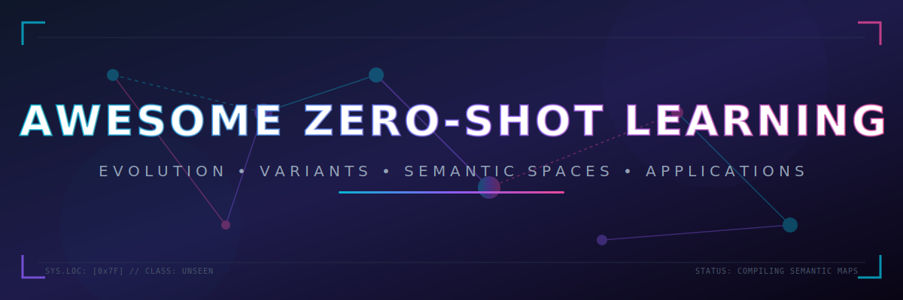
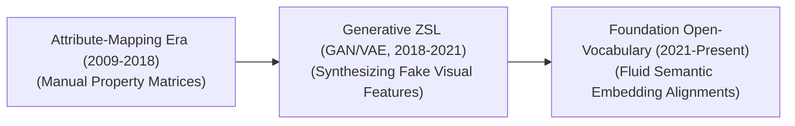

  

# Awesome Zero-Shot Learning (ZSL) 🚀

> A curated list of zero-shot learning resources, evolution phases, operational variants, auxiliary semantic spaces, engineering mitigations, and frontier real-world applications.

      

---

## 📌 Table of Contents
- [📖 Introduction](#-introduction)
- [📅 1. The Chronological Evolution](#-1-the-chronological-evolution)
- [⚙️ 2. Core Operational & Setting Variants](#%EF%B8%8F-2-core-operational--setting-variants)
- [🌐 3. Semantic Auxiliary Spaces](#-3-semantic-auxiliary-spaces)
- [⚠️ 4. Production Engineering Bottlenecks & Mitigations](#%EF%B8%8F-4-production-engineering-bottlenecks--mitigations)
- [🚀 5. Frontier Real-World Applications](#-5-frontier-real-world-applications)

---

## 📖 Introduction

**Zero-Shot Learning (ZSL)** is an advanced machine learning paradigm where a model learns to recognize, classify, or reason about completely novel target classes that it never explicitly encountered during its training phase. Traditional supervised classification models require dozens or thousands of annotated examples for every single target class. ZSL breaks away from this limitation by leveraging intermediate auxiliary information—such as textual descriptions, semantic attribute vectors, or shared embedding spaces—to bridge the gap between known source categories and unknown destination categories, mirroring the human ability to identify an object based purely on a linguistic description. 🧠

---

## 📅 1. The Chronological Evolution

The technical progression of zero-shot execution has transitioned from rigid, hand-crafted attribute grids to generative data reconstruction, moving toward fluid, open-vocabulary foundation spaces.

| Era / Concept | Description & Key Details | Year First Used | First Used Paper |
| :--- | :--- | :---: | :--- |
| [**The Attribute-Mapping Era**](details/attribute_mapping_era.md) | **Concept:** The foundation. Established zero-shot classification by breaking down categories into high-level, human-defined semantic attributes (e.g., `[has_stripes: yes, has_wings: no, lives_in_water: no]`). The model learns to detect these individual attributes on known objects and associates them at test time to identify an unseen animal (like a zebra).  **Limitation:** Highly rigid and expensive, requiring human experts to manually configure massive attribute truth tables for every single category. | 2009 | [Lampert et al. (2009)](https://ieeexplore.ieee.org/document/5206594) / [Farhadi et al. (2009)](https://www.cs.cmu.edu/~ali/farhadi_cvpr09.pdf) |
| [**The Generative Feature Synthesis Era**](details/generative_feature_synthesis_era.md) | **Concept:** Addressed the systemic challenge of missing visual data by using **Generative Adversarial Networks (GANs)** or **Variational Autoencoders (VAEs)**. Instead of mapping a novel image onto text attributes, the generative model takes a textual class definition and synthesizes realistic *hidden visual features* for that unseen class, converting a zero-shot problem into a standard supervised task. | 2018 | [Xian et al. (2018)](https://arxiv.org/abs/1712.00981) |
| [**The Foundation & Open-Vocabulary Era**](details/foundation_open_vocabulary_era.md) | **Concept:** Popularized by web-scale multi-modal architectures like OpenAI's **CLIP** and **Segment Anything (SAM)**. Zero-shot learning evolved from an isolated academic optimization trick into a native architectural property. By projecting language and pixels into a unified vector space, any arbitrary natural language prompt acts as an instant, dynamically generated classification head. | 2021 | [Radford et al. (2021)](https://arxiv.org/abs/2103.00020) |

---

## ⚙️ 2. Core Operational & Setting Variants

Zero-shot algorithms are strictly categorized based on whether the test evaluation space is restricted to purely novel classes or open to the entire dataset landscape.

| Setting / Variant | Mechanism & Limitations | Year First Used | First Used Paper |
| :--- | :--- | :---: | :--- |
| [**Standard Zero-Shot Learning (Conventional ZSL)**](details/standard_zsl.md) | **Mechanism:** The test evaluation phase assumes a closed environment where the incoming data points belong *exclusively* to unseen, novel classes.  **Limitation:** Highly unrealistic for real-world deployments, as a production model cannot predict beforehand whether a user will present a common or a rare item. | 2009 | [Palatucci et al. (2009)](https://papers.nips.cc/paper/3675-zero-shot-learning-with-semantic-output-codes) |
| [**Generalized Zero-Shot Learning (GZSL)**](details/generalized_zsl.md) | **Mechanism:** The realistic production standard. During the test phase, the model is evaluated on a mixture of both seen training classes and entirely unseen testing classes concurrently.  **The Hurdle:** Suffered heavily from **Hubness and Projection Bias**, where the network displays an aggressive mathematical bias, erroneously classifying novel inputs into seen categories because those seen vectors possess highly dominant parameter regions. | 2016 | [Chao et al. (2016)](https://arxiv.org/abs/1605.04253) |
| [**Transductive Zero-Shot Learning**](details/transductive_zsl.md) | **Mechanism:** A semi-supervised variant where the model is given unannotated, unlabeled data samples from the unseen target classes during the training loop. It leverages the underlying geometric distribution of the unlabeled data points to calibrate its semantic boundaries before final classification. | 2015 | [Fu et al. (2015)](https://ieeexplore.ieee.org/document/7086300) |

---

## 🌐 3. Semantic Auxiliary Spaces

To execute zero-shot translations, models rely on different intermediate semantic spaces to transfer knowledge from seen to unseen distributions.

| Semantic Space | Space Profile & Behavior | Year First Used | First Used Paper |
| :--- | :--- | :---: | :--- |
| [**User-Defined Attribute Spaces**](details/user_defined_attribute_spaces.md) | **Space Profile:** Hand-crafted binary or continuous property grids mapped out by human annotators (e.g., shape, color, material, habitat).  **Behavior:** Highly interpretable, but lacks scaling efficiency due to the heavy manual engineering bottleneck. | 2009 | [Lampert et al. (2009)](https://ieeexplore.ieee.org/document/5206594) |
| [**Static Word Embedding Spaces (Word2Vec / GloVe)**](details/static_word_embeddings.md) | **Space Profile:** Unsupervised vector spaces learned from massive text-only corpuses. Words that share semantic concepts naturally sit close together in coordinate distance (e.g., `King - Man + Woman = Queen`).  **Behavior:** Bypasses human labeling loops entirely, but can suffer from language-to-vision misalignment gaps. | 2013 | [Frome et al. (2013)](https://papers.nips.cc/paper/5204-devise-a-deep-visual-semantic-embedding-model) |
| [**Contextualized Text Foundations (LLM Embeddings)**](details/contextualized_text_foundations.md) | **Space Profile:** Modern rich token maps extracted from frontier encoders (such as BERT, T5, or GPT layers).  **Behavior:** Captures deep nuance, encyclopaedic facts, and relational properties, allowing the model to perform zero-shot tracking over highly abstract technical definitions or complex situational prompts. | 2019 | [Radford et al. (2019)](https://d4mucfpruyw0t.cloudfront.net/better-language-models/language_models_are_unsupervised_multitask_learners.pdf) |

---

## ⚠️ 4. Production Engineering Bottlenecks & Mitigations

Deploying zero-shot classification profiles into high-throughput enterprise systems requires balancing projection limits and data distributions.

| Bottleneck | Phenomenon & Mitigation | Year First Used | First Used Paper |
| :--- | :--- | :---: | :--- |
| [**The Hubness Problem**](details/hubness_problem.md) | **The Phenomenon:** When projecting high-dimensional visual feature vectors into lower-dimensional semantic spaces, a small cluster of points (dubbed "hubs") naturally become the nearest neighbors to almost all vectors in the space, causing massive misclassification errors.  **Mitigation:** Implementing **Normalize-Distance Functions** (like Cosine Similarity or Normalized Euclidean Spaces) or applying **Orthogonal Regularization Loss** during training to distribute class anchors evenly across the hypersphere. | 2014 | [Dinu et al. (2014)](https://arxiv.org/abs/1412.6568) |
| [**Domain Shift (Semantic Gap)**](details/domain_shift.md) | **The Phenomenon:** A model might learn what a "striped coat" looks like on a horse, but completely fail to recognize a "striped coat" on a fish (like a tiger shark) because the underlying data domain has fundamentally ruptured.  **Mitigation:** Moving away from absolute projection mapping toward **Joint Embedding Frameworks** (such as contrastive alignment networks) where vision and language towers co-adapt over shared token filters. | 2015 | [Kodirov et al. (2015)](https://www.cv-foundation.org/openaccess/content_iccv_2015/html/Kodirov_Unsupervised_Domain_Adaptation_ICCV_2015_paper.html) |

---

## 🚀 5. Frontier Real-World Applications

| Application | Application Details | Year First Used | First Used Paper |
| :--- | :--- | :---: | :--- |
| [**Zero-Shot Medical Abnormality Detection**](details/medical_abnormality_detection.md) | **Application:** Applied to rare disease identification where collecting patient training samples is practically impossible. Open-vocabulary vision models analyze specialized diagnostic charts, flagging rare genetic tissue variants or uncommon fractures based purely on textual medical encyclopedia descriptions. | 2022 | [Tiu et al. (2022)](https://www.nature.com/articles/s41551-022-00936-9) |
| [**Dynamic E-Commerce Category & Inventory Tagging**](details/ecommerce_tagging.md) | **Application:** Automated warehouse stock tagging systems. When a retail marketplace drops an entirely new line of customized seasonal goods, zero-shot perception engines automatically index and tag incoming warehouse photos with long-tail metadata without requiring any classification model retraining loops. | 2022 | [Yang et al. (2022)](https://arxiv.org/abs/2112.08316) |
| [**Zero-Shot Content Moderation & Policy Enforcement**](details/content_moderation.md) | **Application:** Monitored text and image moderation engines. Trust and safety teams update online safety guidelines dynamically by entering natural language descriptions of emerging malicious behavior or complex online safety violations. The zero-shot model screens live user text and image posts instantly for those unique guidelines without manual annotation intervals. | 2023 | [OpenAI (2023)](https://openai.com/index/using-gpt-4-for-content-moderation/) |

---

## 📈 Star History

<a href="https://www.star-history.com/?repos=ishandutta2007%2FAwesome-Zero-Shot-Learning&type=date&legend=bottom-right">
<picture>
<source media="(prefers-color-scheme: dark)" srcset="https://api.star-history.com/chart?repos=ishandutta2007/Awesome-Zero-Shot-Learning&type=date&theme=dark&legend=bottom-right" />
<source media="(prefers-color-scheme: light)" srcset="https://api.star-history.com/chart?repos=ishandutta2007/Awesome-Zero-Shot-Learning&type=date&legend=bottom-right" />

</picture>
</a>

