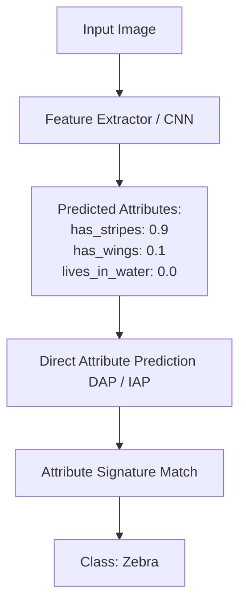

# The Attribute-Mapping Era (2009-2018)

The Attribute-Mapping Era established the foundations of Zero-Shot Learning (ZSL) in computer vision. It relied on intermediate semantic attribute spaces to bridge the gap between seen and unseen classes. 

### How It Works:
Instead of predicting class labels directly, the model is trained to predict human-defined attributes (e.g., `has_stripes`, `has_wings`, `lives_in_water`). At test time, a novel class (like a zebra) is identified by matching its predefined attribute signature against the predicted attributes of the test image.

### Prominent Architectures:
- **Direct Attribute Prediction (DAP):** Learns attribute classifiers independently, then computes posterior class probabilities.
- **Indirect Attribute Prediction (IAP):** Predicts seen class probabilities first, then projects them onto the attribute space to infer unseen classes.

## Architectural & Process Diagram

---

[← Back to Main README](../README.md)
