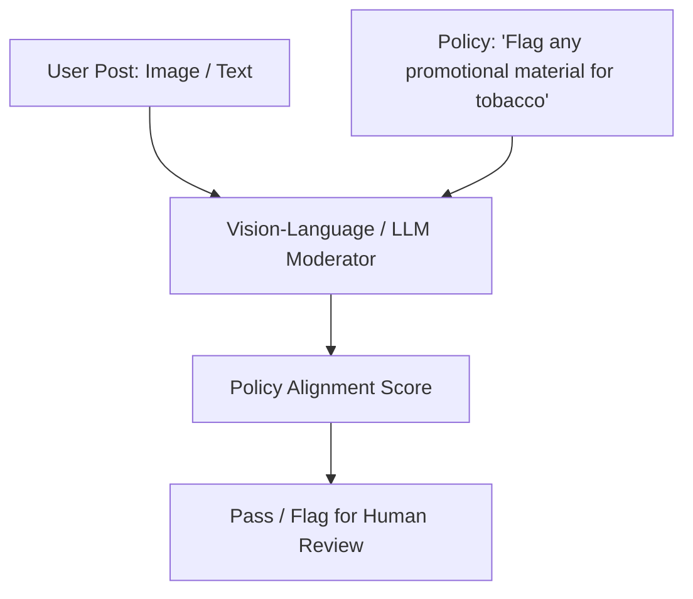

# Zero-Shot Content Moderation & Policy Enforcement

Zero-shot content moderation allows platforms to enforce dynamically changing community guidelines and trust-and-safety policies instantly without waiting for manual annotation cycles.

### How It Works:
Instead of training specialized classification models for each form of policy violation, trust and safety teams write policy guidelines in plain English. Large Language Models (like GPT-4) or vision-language models process live user posts (text/images) and evaluate them against these guidelines in a zero-shot manner.

## Architectural & Process Diagram

---

[← Back to Main README](../README.md)
