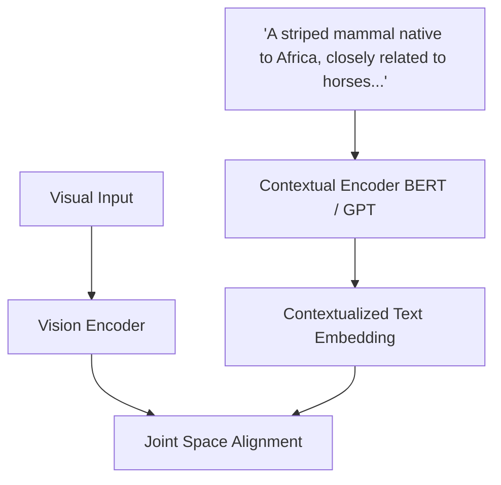

# Contextualized Text Foundations (LLM Embeddings)

Contextualized Text Foundations represent the evolution from static word vectors to deep contextual representations generated by Large Language Models (LLMs) and transformer encoders (e.g., BERT, GPT).

### How It Works:
Rather than representing a class with a single word token, classes are defined using complex descriptions, Wikipedia articles, or prompt templates. A transformer encoder maps these rich text descriptions to high-dimensional contextual embeddings, capturing subtle semantic nuances and encyclopedic knowledge to improve zero-shot alignment.

## Architectural & Process Diagram

---

[← Back to Main README](../README.md)
