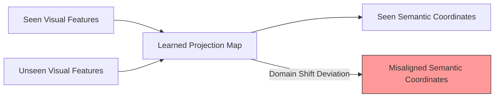

# Domain Shift (Semantic Gap)

Domain Shift (or Projection Domain Shift) occurs when the mapping function learned on seen classes fails to generalize to unseen classes.

### The Phenomenon:
Even if a model learns to accurately project visual features of "seen" classes to their semantic coordinates, the visual-semantic mapping might not hold for "unseen" classes due to structural differences in their feature distributions.

### Mitigations:
- **Joint Embeddings:** Moving away from unidirectional projection (visual $\rightarrow$ semantic) to a shared joint space (contrastive learning).
- **Transductive Learning:** Calibrating projections using unlabeled test samples.

## Architectural & Process Diagram

---

[← Back to Main README](../README.md)
