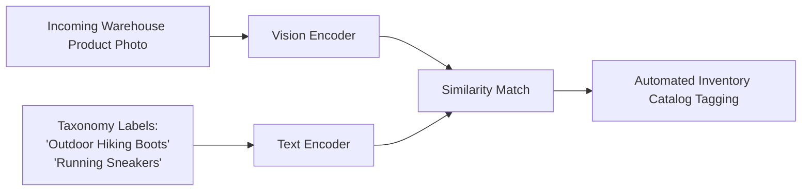

# Dynamic E-Commerce Category & Inventory Tagging

Zero-shot inventory tagging enables automated categorization of rapidly changing retail catalogs without retraining classification models.

### How It Works:
E-commerce catalogs regularly introduce new, niche products. A zero-shot system encodes incoming product images and matches them against target taxonomy categories (e.g., using the MAVE dataset baseline). This automates inventory sorting, attribute value extraction, and catalog search indexing dynamically.

## Architectural & Process Diagram

---

[← Back to Main README](../README.md)
