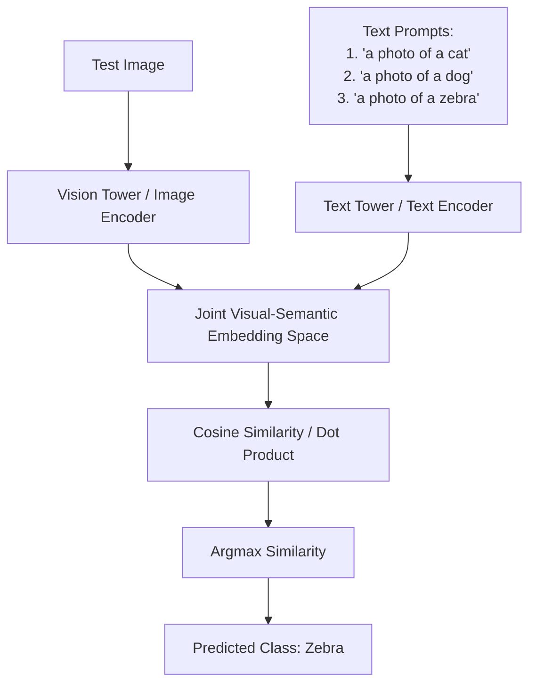

# The Foundation & Open-Vocabulary Era (2021-Present)

The modern era of Zero-Shot Learning is defined by large-scale, multi-modal foundation models trained on billions of image-text pairs. Zero-shot recognition is no longer an auxiliary training objective but a native capability of the architecture.

### How It Works:
Models like OpenAI's **CLIP** or Google's **ALIGN** align vision and language representations in a joint embedding space using contrastive learning. At test time, classification is framed as matching the image embedding with text embeddings of various prompts (e.g., "a photo of a [class]").

### Key Advantages:
- Extremely robust generalization to unseen domains.
- No need to train class-specific attribute classifiers or generators.
- True open-vocabulary inference capabilities.

## Architectural & Process Diagram

---

[← Back to Main README](../README.md)
