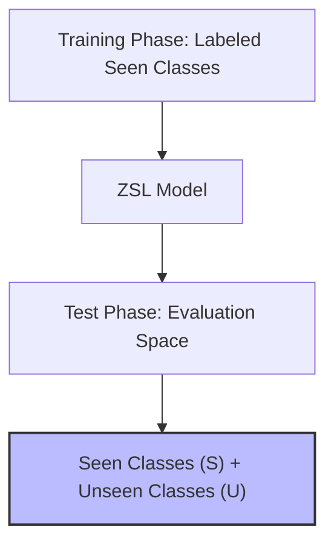

# Generalized Zero-Shot Learning (GZSL)

Generalized Zero-Shot Learning (GZSL) is the realistic benchmark setting for zero-shot evaluation. 

### Setting Profile:
Unlike standard ZSL, the search space during the test phase contains both seen ($S$) and unseen ($U$) classes simultaneously. 

### The Projection Bias Challenge:
Because the model has only seen training images from $S$, it develops an extreme bias toward predicting seen classes. Visual features of unseen classes are mapped close to seen class anchors in the semantic space, leading to poor accuracy on unseen classes. This is mitigated using calibration, temperature scaling, or generative synthesis.

## Architectural & Process Diagram

---

[← Back to Main README](../README.md)
