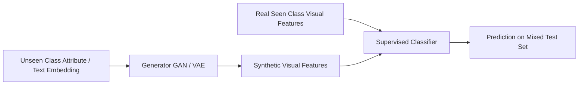

# The Generative Feature Synthesis Era (2018-2021)

The Generative Feature Synthesis Era emerged to solve the challenge of missing visual data for unseen classes. Instead of learning a mapping from visual space to semantic space (which suffers from hubness and projection bias), generative models synthesize visual features directly from semantic descriptions.

### How It Works:
- A Generative Adversarial Network (GAN) or Variational Autoencoder (VAE) is trained on seen classes to generate visual features conditioned on class attributes or text embeddings.
- Once trained, the generator takes semantic vectors of **unseen classes** and generates synthetic visual features.
- A standard supervised classifier (e.g., Softmax or SVM) is then trained on a mixture of real features (seen classes) and synthetic features (unseen classes).

## Architectural & Process Diagram

---

[← Back to Main README](../README.md)
