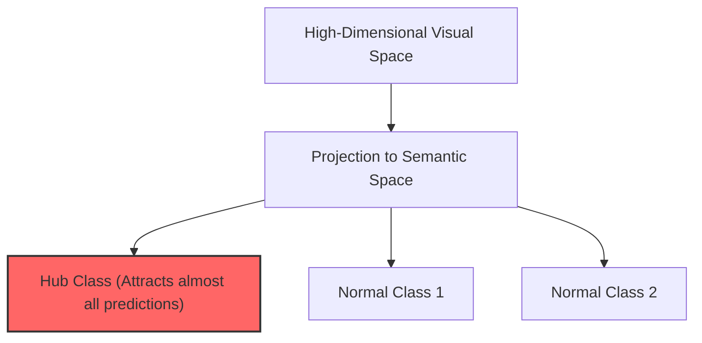

# The Hubness Problem

The Hubness Problem is a fundamental geometric phenomenon that plagues nearest-neighbor search in high-dimensional spaces, severely impacting Zero-Shot Learning.

### The Phenomenon:
When high-dimensional visual features are projected into a lower-dimensional semantic space, a small set of points (called **hubs**) become the nearest neighbors to a disproportionately large number of query vectors. Consequently, the model erroneously predicts these "hub" classes for almost all test samples.

### Mitigations:
- Using cosine similarity instead of Euclidean distance.
- Normalizing projection distributions.
- Applying orthogonal regularization constraints during training to spread class anchors evenly.

## Architectural & Process Diagram

---

[← Back to Main README](../README.md)
