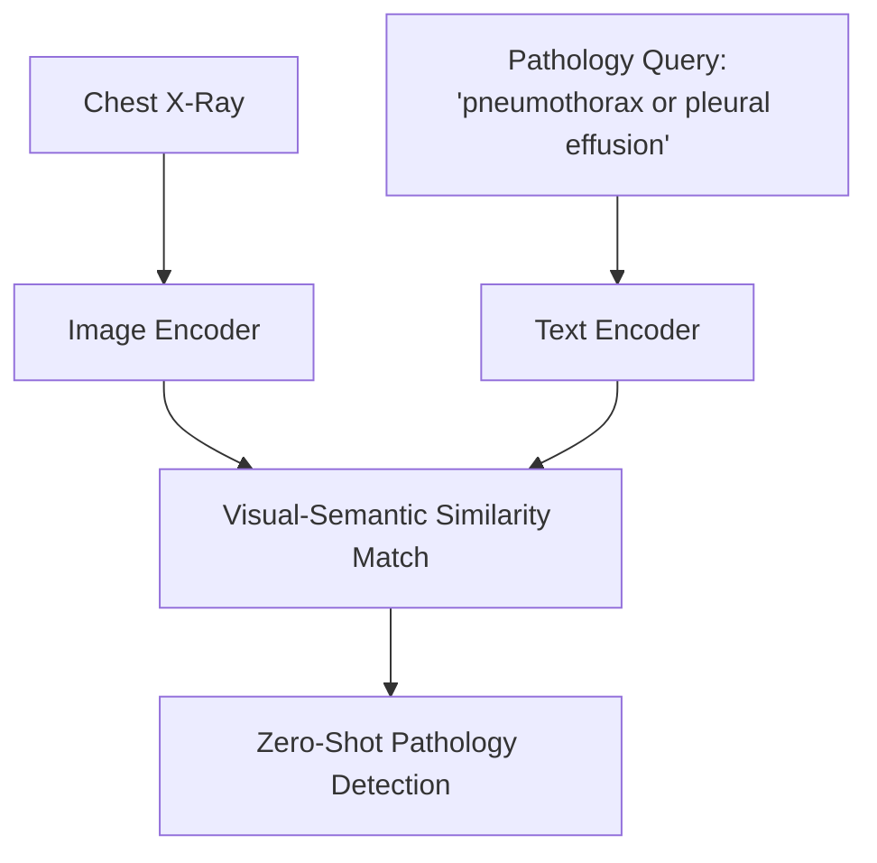

# Zero-Shot Medical Abnormality Detection

Zero-shot medical abnormality detection addresses the challenge of identifying rare diseases and clinical pathologies where labeled training data is scarce or impossible to collect.

### How It Works:
Models like **CheXzero** adapt multi-modal architectures (such as CLIP) to medical images (e.g., Chest X-rays) and radiology reports. Clinical notes are encoded to form descriptive pathology queries, and the model identifies abnormalities in medical scans without relying on manual bounding boxes or label annotations.

## Architectural & Process Diagram

---

[← Back to Main README](../README.md)
