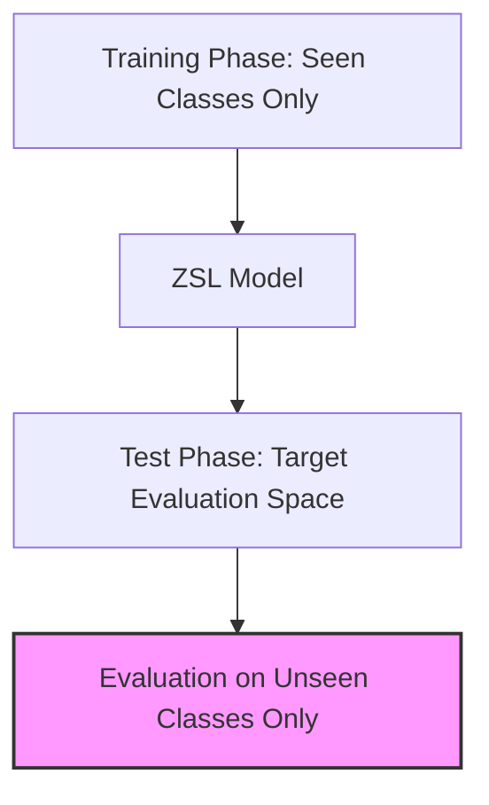

# Standard Zero-Shot Learning (Conventional ZSL)

Standard or Conventional Zero-Shot Learning (ZSL) assumes a simplified test setting where the candidate evaluation space contains *only* unseen classes.

### Setting Profile:
During training, the model has access to labeled samples from seen classes $S$ and semantic descriptions for both seen classes $S$ and unseen classes $U$. At test time, the model is evaluated on images belonging strictly to the unseen set $U$.

### Limitations:
While theoretically interesting, standard ZSL is highly unrealistic for real-world applications. A production classifier cannot guarantee that it will never encounter a seen class (e.g., a dog or a cat) while searching for novel classes.

## Architectural & Process Diagram

---

[← Back to Main README](../README.md)
