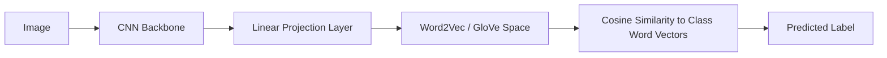

# Static Word Embedding Spaces

Static Word Embedding Spaces (e.g., Word2Vec, GloVe) bypass manual attribute labeling by using vector spaces trained on large text corpora.

### How It Works:
Instead of mapping images to manual attributes, the visual features are projected directly into a pre-trained word embedding space. Unseen classes are identified by finding the word vector closest to the projected visual representation (e.g., using cosine similarity).

### Key Architectures:
- **DeVISE (Deep Visual-Semantic Embedding):** Uses a linear projection layer on top of a CNN to map visual features to Skip-gram word vectors.

## Architectural & Process Diagram

---

[← Back to Main README](../README.md)
