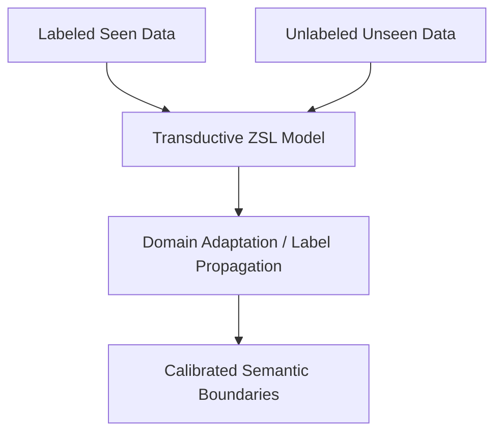

# Transductive Zero-Shot Learning

Transductive Zero-Shot Learning leverages unlabeled samples from unseen classes during training to adapt the model's parameters and combat the domain shift problem.

### How It Works:
While labeled data is only available for seen classes, unlabeled data from unseen classes is provided during training. The model uses semi-supervised or transductive methods (e.g., label propagation, domain adaptation, or graph convolutional networks) to align the visual distribution of unseen classes with their semantic anchors before final evaluation.

## Architectural & Process Diagram

---

[← Back to Main README](../README.md)
