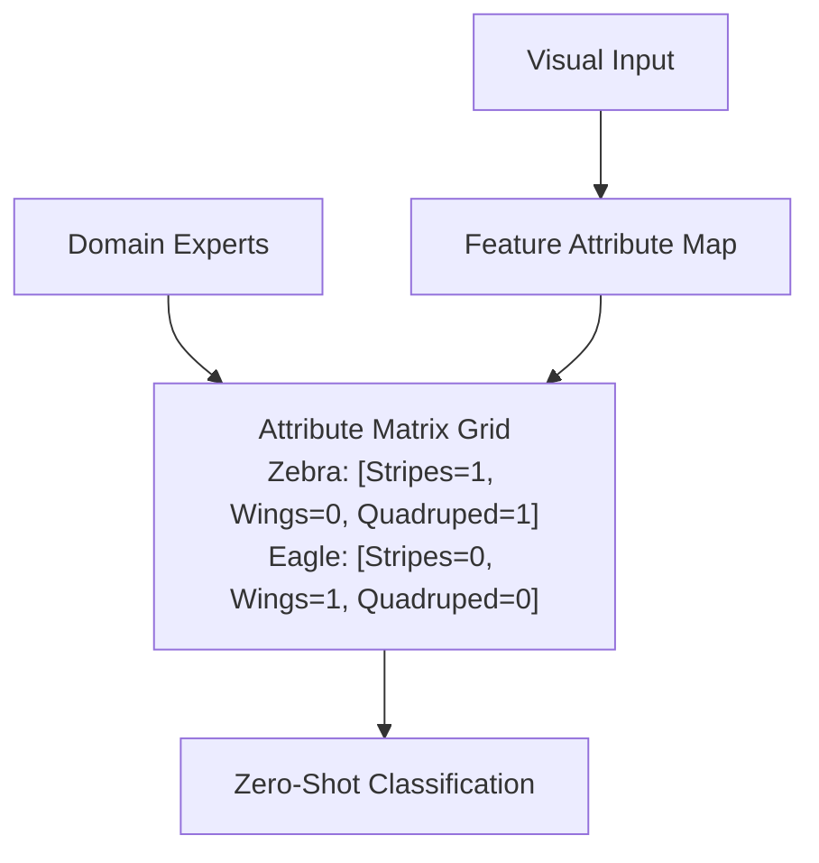

# User-Defined Attribute Spaces

User-Defined Attribute Spaces represent the classical approach to zero-shot transfer, utilizing human-engineered properties as the intermediate representation.

### How It Works:
Domain experts manually construct an attribute matrix where each class is defined by a set of binary or continuous attributes (e.g., `is_yellow`, `has_spots`, `is_carnivore`). 

### Pros & Cons:
- **Pros:** Highly interpretable; allows developers to inspect why a model made a specific zero-shot prediction.
- **Cons:** Extremely expensive to scale. Designing comprehensive attribute grids for thousands of categories is tedious and prone to human bias.

## Architectural & Process Diagram

---

[← Back to Main README](../README.md)
